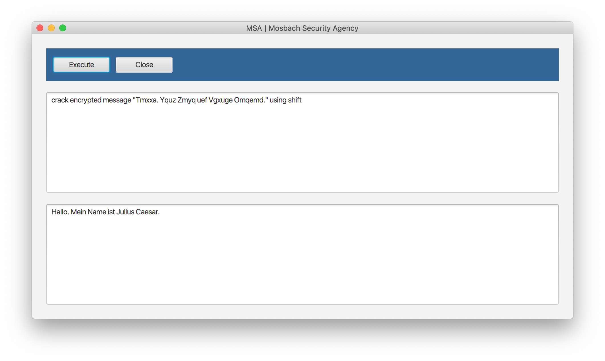

# DHBW.Krypto-MSA

## Beispiel anhand der Nachricht "morpheus"
**Encrypt/Decrypt with RSA**  
`encrypt message "morpheus" using RSA and keyfile rsa32`  
`decrypt message "JbkPFt+y+j8=" using RSA and keyfile rsa32`  
`crack encrypted message "JbkPFt+y+j8=" using RSA and keyfile rsa32`  
Cracking fails due to timeout

**Crackable RSA example**  
`crack encrypted message "BqGfopSO" using RSA and keyfile rsa24`

**Encrypt/Decrypt with Shift**  
`encrypt message "morpheus" using shift and keyfile shift13`  
`decrypt message "zbecurhf" using shift and keyfile shift13`  
`crack encrypted message "zbecurhf" using shift`

## Anmerkungen zur Implementierung
Um die Anwendung funktionsfähig zu bekommen, sind Abweichungen von der Aufgabenstellung notwendig.

**Eventbus**  
Damit der Eventbus korrekt funktioniert, musste die `failureaccess-1.0.1.jar` ergänzt werden, da sonst immer nur Fehlermeldungen angezeigt wurden.

**Cracker**  
Der RSA Cracker benötigt eine `File` für den öffentlichen Schlüssel. Um beim Arbeiten mit der Komponente keine Fallunterscheidung vornehmen zu müssen, wurde das Interface für den Shift Cracker auch um `File` erweitert. Das übergebene Objekt wird jedoch nicht verarbeitet.

Schnittstelle RSA Cracker:  
`String decrypt(String encryptedMessage, File publicKeyfile);`

Schnittstelle Shift Cracker:  
`String decrypt(String encryptedMessage, File file);`

Der CQL Befehl wurde erweitert mit der Option eine Datei zu übergeben:
`crack encrypted message "[message]" using [algorithm] [and keyfile [filename]]`

## CQL (Cryptographic Query Language)
- **show algorithm**  
Die in Komponenten gekapselten Algorithmen werden angezeigt.
Die Meldung im Ausgabebereich der GUI wird dynamisch aus den Dateinamen der jar im Verzeichnis components ermittelt; shift | rsa
- **encrypt message "[message]" using [algorithm] and keyfile [filename]**  
Die zu dem Algorithmus korrespondierende Komponente [algorithm].jar wird dynamisch geladen und die Meldung mit dem key verschlüsselt.  
Die verschlüsselte Meldung wird im Ausgabebereich der GUI angezeigt.
- **decrypt message "[message]" using [algorithm] and keyfile [filename]**  
Die zu dem Algorithmus korrespondierende Komponente [algorithm].jar wird dynamisch geladen und die Meldung mit dem key entschlüsselt.  
Die entschlüsselte Meldung wird im Ausgabebereich der GUI angezeigt.
- **crack encrypted message "[message]" using [algorithm]**  
Die zu dem Algorithmus korrespondierende Komponente [algorithm]\_cracker.jar wird dynamisch geladen und versucht innerhalb von maximal 30 Sekunden die Meldung zu entschlüsseln. Wurde die Meldung innerhalb der Zeitvorgabe entschlüsselt, wird die entschlüsselte Meldung im Ausgabebereich der GUI angezeigt.  
Wurde die Meldung nicht innerhalb der Zeitvorgabe entschlüsselt, erfolgt die Meldung "_cracking encrypted message "[message]" failed_" im Ausgabebereich der GUI.
- **register participant [name] with type [normal | intruder]**  
Existiert kein Teilnehmer mit diesem Namen wird [i] ein Datensatz in der Tabelle particpants und [ii] die Tabelle postbox_[participant_name] angelegt.  
 Im Ausgabebereich der GUI wird die Meldung "_participant [name] with type [normal | intruder] registered and postbox\_[participant_name] created_" angezeigt.  
 Existiert ein Teilnehmer mit diesem Namen wird die Meldung "_participant [name] already exists, using existing postbox\_[participant_name]_" im Ausgabebereich der GUI angezeigt.  
 Für die **Simulation** werden folgende participants angelegt:  
branch_hkg &ensp; normal  
branch_cpt &ensp; normal  
branch_sfo &ensp; normal  
branch_syd &ensp; normal  
branch_wuh &ensp;normal  
msa &ensp;&ensp;&ensp;&ensp;&ensp;&ensp; intruder
- **create channel [name] from [participant01] to [participant02]**  
Ein **Channel ist** als **dedizierter EventBus** – basierend auf Google Guava – realisiert.  
Für die bidirektionale Kommunikation bzw. das Senden von verschlüsselten Nachrichten zwischen Participant vom Typ normal ist ein Channel notwendig.  
 Existiert bereits ein Channel mit dem Namen wird die Fehlermeldung "_channel [name] already exists_" im Ausgabebereich der GUI angezeigt. Existiert bereits eine Kommuni- kationsbeziehung zwischen participant01 und participant02, wird die Fehlermeldung "_communication channel between [participant01] and [participant02] already exists_" im Ausgabebereich der GUI angezeigt.  
 Sind participant01 und participant02 identisch, wird die Fehlermeldung "_[participant01] and [participant02] are identifical – cannot create channel on itself_" im Ausgabebereich der GUI angezeigt.  
 Existiert [i] kein Channel mit dem Namen und [ii] keine Kommunikationsbeziehung zwischen den beiden participant, wird ein Datensatz in der Tabelle channel angelegt und die Meldung "_channel [name] from [participant01] to [participant02] successfully created_" im Ausgabebereich der GUI angezeigt.
 Nach erfolgreicher Erstellung eines channel erfolgt die Meldung "_channel [name] from [participant01] to [participant02] created_" im Ausgabebereich der GUI, in der Tabelle channel wird ein Datensatz angelegt.  
 Für die **Simulation** werden folgende channel angelegt:  
hkg_wuh &ensp; branch_hkg &ensp; branch_wuh  
hkg_cpt &ensp; branch_hkg &ensp; branch_cpt  
cpt_syd &ensp; branch_cpt &ensp; branch_syd  
syd_sfo &ensp; branch_syd &ensp; branch_sfo
- **show channel**  
Im Ausgabebereich der GUI werden die Channel angezeigt.  
_hkg\_wuh_ &ensp; | _branch\_hkg and branch\_wuh_  
_hkg\_cpt_ &ensp; | _branch\_hkg and branch\_cpt_  
_cpt\_syd_ &ensp; | _branch\_cpt and branch\_syd_  
_syd\_sfo_ &ensp; | _branch\_syd and branch\_sfo_
- **drop channel [name]**  
Existiert der channel mit dem Namen, wird dieser Datensatz aus der Tabelle channel gelöscht und im Ausgabebereich der GUI die Meldung "_channel [name] deleted_" angezeigt. Existiert kein channel mit dem Namen, wird im Ausgabebereich der GUI die Fehlermeldung "_unknown channel [name]_" ausgegeben.
- **intrude channel [name] by [participant]**  
Existiert der channel mit den Namen, wird der participant vom Typ intruder für den Channel registriert und erhält alle Nachrichten die über diesen Channel kommuniziert werden.  
 Bei Erhalt einer Nachricht wird in der Tabelle postbox des intruder ein neuer Datensatz erstellt, das Attribut message wird auf den Wert unknown gesetzt.  
 Der participant lädt dynamisch die zu dem Algorithmus korrespondierende Komponente [algorithm]\_cracker.jar und versucht innerhalb von maximal 30 Sekunden die Meldung zu entschlüsseln. Wird innerhalb der Zeitvorgabe die Nachricht erfolgreich entschlüsselt, wird das Attribut message auf den Wert der Meldung im Klartext gesetzt.  
 Im Fall einer erfolgreichen Entschlüsselung wird im Ausgabebereich der GUI die Meldung "_intruder [name] cracked message from participant [name] | [message]_" angezeigt.  
 Im Fall einer nicht erfolgreichen Entschlüsselung wird im Ausgabebereich der GUI die Meldung "_intruder [name] | crack message from participant [name] failed_" angezeigt.
- **send message "[message]" from [participant01] to [participant02] using [algorithm] and keyfile [name]**  
Die Nachricht wird mit dem Algorithmus und keyfile verschlüsselt und von participant01 an participant02 über den Channel kommuniziert.  
 Existiert zwischen participant01 und participant02 kein channel, wird die Fehlermeldung "_no valid channel from [participant01] to [participant02]_" im Ausgabebereich der GUI angezeigt.  
 Existiert zwischen participant01 und participant02 ein channel wird die Nachricht mit dem Algorithmus und keyfile verschlüsselt und über den Channel kommuniziert.  
 Das Versenden der Nachricht wird in der Tabelle messages protokolliert.  
 Der Empfänger participant02 lädt dynamisch die zu dem Algorithmus korrespondierende Komponente [algorithm].jar und entschlüsselt die Nachricht. Nach Entschlüsselung wird in der Tabelle postbox_[participant02_name] ein Datensatz erstellt und Ausgabebereich der GUI die Meldung "_[participant02_name] received new message_" angezeigt.
## Aufgabenstellung
- **Programmiersprache**  
Java 11 (LTS)
- **IDE**  
IntelliJ IDEA Community
- **Implementierung** einer technisch einwandfrei lauffähigen Applikation. Kommunikation der Nachricht "morpheus".
- Nutzung der **camelCase-Notation**, um die Lesbarkeit zu vereinfachen.
- Verwendung geeigneter englischer Begriffe für Namen und Bezeichnungen.
- **Zulässige externe Bibliotheken**: JavaFX, Google Guava, HSQLDB
- **Erstellung einer vollständigen 7-Zip-Datei und Upload in Moodle.**
- **Zeitansatz**: 50 Stunden
- **Abgabetermin**: Sonntag, 18.10.2020
- **Bewertung**: 50 Punkte
